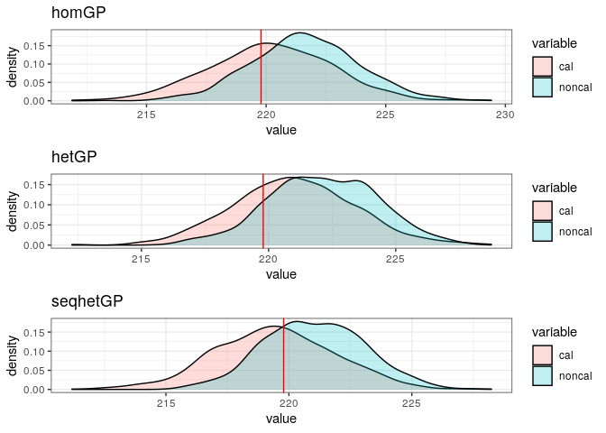
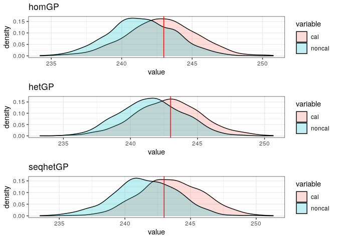
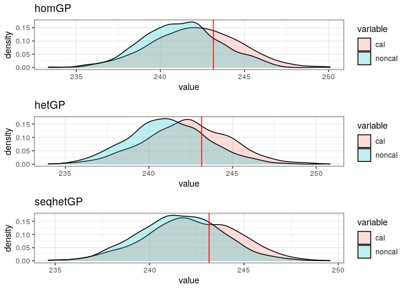
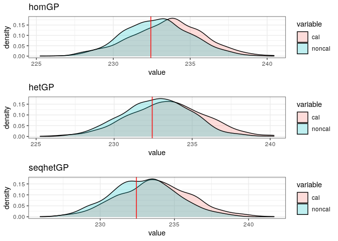

Calibration of the Ocean Simulator
================
Pierre Barbillon
July 1, 2020

``` r
rm(list=ls())
library(ggplot2)
library(colorRamps)
library(gridExtra)
library(DiceKriging)
library(DiceDesign)
library(hetGP)
library(MCMCpack)
library(lhs)
library(mvtnorm)
library(parallel)
library(reshape2)
```

Loading simulator and GPEs (homGP, hetGP and seqhetGP which is hetGP
with a sequential design)

``` r
# functions
source("SimulatorAndFunctions.R")
source("FunctionCalibration.R")
```

Fixing seed

``` r
seed=1234
set.seed(seed)
```

## Retrieving field data

``` r
Field = read.table("FieldData.csv",sep=" ")
Xfield = as.matrix(Field[,1:4])
Yfieldnoise = Field[,5]
n = nrow(Xfield)
Ym <- mean(Yfieldnoise)
Yv <- var(Yfieldnoise)
YfieldnoiseN <- (Yfieldnoise-Ym)/sqrt(Yv)
vareps = 2^2 
```

Simulate discrepancy field

``` r
test = read.csv("testdata2D.csv",sep=" ")
testdesign = as.matrix(test[,1:2])
# simulate discrepancy
Xfielduniloc = unique.matrix(Xfield)
# simulate discrepancy and add it to field data
#disc = simdiscrepancy(rbind(Xfielduniloc[,1:2],testdesign),psi=c(1,2))
#YfieldnoiseN <- (Yfieldnoise-Ym)/sqrt(Yv) + rep(disc[1:nrow(Xfielduniloc)],2)
# or reload it
disc = read.table("discrepancy.csv")[,1]
YfieldnoiseN = read.table("noisyfielddata.csv")[,1]
```

## Emulators

Either

``` r
#load("EmulatorCalib4D.Rdata")
```

Or

``` r
## From Static design
Static = read.table("staticDOEcalibration.csv")
Xsim = as.matrix(Static[,1:4])
Ysim = Static[,5]
YsimN = (Ysim-Ym)/sqrt(Yv)  
  
covtype <- "Matern5_2"
noiseControl <- list(g_min=1e-6, g_bounds=c(1e-6, 1), lowerDelta=log(1e-6))
settings <- list(linkThetas="none", initStrategy="smoothed", return.hom=TRUE)
lower <- c(0.01, 0.01, 0.001, 0.001) 
upper <- c(30, 30, 100, 100) 

het <- mleHetGP(Xsim, YsimN, lower=lower, upper=upper, covtype=covtype, noiseControl=noiseControl, 
                settings=settings, maxit=10000)
hom <- het$modHom

## Sequential design
Seq = read.table("seqDOEcalibration.csv")
Xseq = as.matrix(Seq[,1:4])
Yseq = Seq[,5]
YseqN = (Yseq-Ym)/sqrt(Yv)  
  
covtype <- "Matern5_2"
noiseControl <- list(g_min=1e-6, g_bounds=c(1e-6, 1), lowerDelta=log(1e-6))
settings <- list(linkThetas="none", initStrategy="smoothed", return.hom=TRUE)
lower <- c(0.01, 0.01, 0.001, 0.001) 
upper <- c(30, 30, 100, 100) 

seqhet <- mleHetGP(Xseq, YseqN, lower=lower, upper=upper, covtype=covtype, noiseControl=noiseControl, 
                settings=settings, maxit=10000)
```

## Calibration

Settings for MCMC

``` r
nMCMC = 1e5  #1e6
nburnin =  2e4 
# variance for random walks
Vrw <- diag(c(.05,.05,.1,.1))/2
Uprior =c(.5,.5)
Thin = 100
```

Calibration with homGP

``` r
homMLEdisc = RangeEstim(Xfield[,1:2],YfieldnoiseN,hom,Uprior,vareps,rep=2)
# Run MH algo for calibration is time consuming
# calHom <- MCMCmetrop1R(postcalibrationwithdiscrep, XF=Xfield[,1:2], yF=YfieldnoiseN, GP=hom,
#                        Sigdisc=homMLEdisc$Sigdisc,priorUpBounds2b=3/Yv,rep=2,logvar=T
#                              ,logfun=TRUE, theta.init=c(0.5,0.5,log(2/Yv),log(2/Yv)),
#                              burnin=nburnin, mcmc=nMCMC,V=Vrw,thin=Thin)
# write.table(calHom,file="calHom.csv")


# reloading saved calibration results
calHom = read.table("calHom.csv",h=T,sep=" ")
calHom = as.matrix(calHom)
dfcalhom = as.data.frame(calHom)
names(dfcalhom) = c("u1","u2","s2f","s2b")
dfcalhom[,1:2] = dfcalhom[,1:2] * 900 +100
dfcalhom[,3] = exp(dfcalhom[,3]) * Yv
dfcalhom[,4] = exp(dfcalhom[,4]) * Yv
hom1 = ggplot(dfcalhom,aes(x=u1,stat(density)))+ xlab(expression(K[x])) + geom_density() + theme_bw() + xlim(50,1050) + ylim(0,2e-3) + geom_vline(aes(xintercept=700),color="red")+ scale_x_continuous(breaks=c(100,500,1000),limits = c(50,1050))
```

    ## Scale for 'x' is already present. Adding another scale for 'x', which will
    ## replace the existing scale.

``` r
hom2 = ggplot(dfcalhom,aes(x=u2,stat(density))) + xlab(expression(K[y])) + geom_density() + theme_bw() +xlim(50,1050) + ylim(0,1.2e-2) + geom_vline(aes(xintercept=200),color="red")+scale_x_continuous(breaks=c(100,500,1000),limits = c(50,1050))
```

    ## Scale for 'x' is already present. Adding another scale for 'x', which will
    ## replace the existing scale.

``` r
hom3 = ggplot(dfcalhom,aes(x=s2f,stat(density)))+ xlab(expression(sigma[epsilon]^2))  + geom_density() + theme_bw() + xlim(0,7) + ylim(0,.6) + geom_vline(aes(xintercept=4),color="red")
hom4 = ggplot(dfcalhom,aes(x=s2b,stat(density)))+ xlab(expression(sigma[MD]^2)) + geom_density() + theme_bw() + xlim(0,3)+ylim(0,.6)  +geom_vline(aes(xintercept=Yv*.02),color="red")
```

Calibration with hetGP

``` r
hetMLEdisc = RangeEstim(Xfield[,1:2],YfieldnoiseN,het,Uprior,vareps,rep=2)
# Run MH algo for calibration is time consuming
# calHet <- MCMCmetrop1R(postcalibrationwithdiscrep, XF=Xfield[,1:2], yF=YfieldnoiseN, GP=het,
#                              Sigdisc=hetMLEdisc$Sigdisc,priorUpBounds2b=3/Yv,rep=2,logvar=T
#                              ,logfun=TRUE, theta.init=c(0.5,0.5,log(2/Yv),log(2/Yv)),
#                              burnin=nburnin, mcmc=nMCMC,V=Vrw,thin=Thin)
# write.table(calHet,file="calHet.csv")

# reloading saved calibration results
calHet = read.table("calHet.csv",h=T,sep=" ")
calHet = as.matrix(calHet)
dfcalhet = as.data.frame(calHet)
names(dfcalhet) = c("u1","u2","s2f","s2b")
dfcalhet[,1:2] = dfcalhet[,1:2] * 900 +100
dfcalhet[,3] = exp(dfcalhet[,3]) * Yv
dfcalhet[,4] = exp(dfcalhet[,4]) * Yv
het1 = ggplot(dfcalhet,aes(x=u1,stat(density))) + xlab(expression(K[x]))+ geom_density() + theme_bw() + xlim(50,1050) + ylim(0,2e-3) + geom_vline(aes(xintercept=700),color="red")+scale_x_continuous(breaks=c(100,500,1000),limits = c(50,1050))
```

    ## Scale for 'x' is already present. Adding another scale for 'x', which will
    ## replace the existing scale.

``` r
het2 = ggplot(dfcalhet,aes(x=u2,stat(density)))+ xlab(expression(K[y])) + geom_density() + theme_bw() +xlim(50,1050) + ylim(0,1.2e-2) + geom_vline(aes(xintercept=200),color="red")+scale_x_continuous(breaks=c(100,500,1000),limits = c(50,1050))
```

    ## Scale for 'x' is already present. Adding another scale for 'x', which will
    ## replace the existing scale.

``` r
het3 = ggplot(dfcalhet,aes(x=s2f,stat(density)))+ xlab(expression(sigma[epsilon]^2)) + geom_density() + theme_bw() + xlim(0,7) +ylim(0,.6) + geom_vline(aes(xintercept=4),color="red")
het4 = ggplot(dfcalhet,aes(x=s2b,stat(density))) + xlab(expression(sigma[MD]^2)) + geom_density() + theme_bw() + xlim(0,3) +ylim(0,.6) +geom_vline(aes(xintercept=Yv*.02),color="red")
```

Calibration with seqhetGP

``` r
seqhetMLEdisc = RangeEstim(Xfield[,1:2],YfieldnoiseN,seqhet,Uprior,vareps,rep=2)
# Run MH algo for calibration is time consuming
# calSeqHet <- MCMCmetrop1R(postcalibrationwithdiscrep, XF=Xfield[,1:2], yF=YfieldnoiseN, GP=seqhet,
#                                 Sigdisc=seqhetMLEdisc$Sigdisc,priorUpBounds2b=3/Yv,rep=2,logvar=T
#                              ,logfun=TRUE, theta.init=c(0.5,0.5,log(2/Yv),log(2/Yv)),
#                              burnin=nburnin, mcmc=nMCMC,V=Vrw,thin=Thin)
#write.table(calSeqHet,file="calSeqHet.csv")

# reloading saved calibration results
calSeqHet = read.table("calSeqHet.csv",h=T,sep=" ")
calSeqHet = as.matrix(calSeqHet)
dfcalseqhet = as.data.frame(calSeqHet)
names(dfcalseqhet) = c("u1","u2","s2f","s2b")
dfcalseqhet[,1:2] = dfcalseqhet[,1:2] * 900 +100
dfcalseqhet[,3] = exp(dfcalseqhet[,3]) * Yv
dfcalseqhet[,4] = exp(dfcalseqhet[,4]) * Yv
seqhet1 = ggplot(dfcalseqhet,aes(x=u1,stat(density))) + xlab(expression(K[x]))+ geom_density() + theme_bw() + xlim(50,1050)+ ylim(0,2e-3) + geom_vline(aes(xintercept=700),color="red")+scale_x_continuous(breaks=c(100,500,1000),limits = c(50,1050))
```

    ## Scale for 'x' is already present. Adding another scale for 'x', which will
    ## replace the existing scale.

``` r
seqhet2 = ggplot(dfcalseqhet,aes(x=u2,stat(density)))+ xlab(expression(K[y])) + geom_density() + theme_bw() +xlim(50,1050)+ ylim(0,1.2e-2)  + geom_vline(aes(xintercept=200),color="red")+scale_x_continuous(breaks=c(100,500,1000),limits = c(50,1050))
```

    ## Scale for 'x' is already present. Adding another scale for 'x', which will
    ## replace the existing scale.

``` r
seqhet3 = ggplot(dfcalseqhet,aes(x=s2f,stat(density))) + xlab(expression(sigma[epsilon]^2))+ geom_density() + theme_bw() + xlim(0,7) + ylim(0,.6) + geom_vline(aes(xintercept=4),color="red")
seqhet4 = ggplot(dfcalseqhet,aes(x=s2b,stat(density)))+ xlab(expression(sigma[MD]^2))  + geom_density() + theme_bw() + xlim(0,3) +ylim(0,.6) +geom_vline(aes(xintercept=Yv*.02),color="red")
```

``` r
grid.arrange(arrangeGrob(hom1,hom2,hom3,hom4,top="homGP",ncol=4),arrangeGrob(het1,het2,het3,het4,top="hetGP",ncol=4),
             arrangeGrob(seqhet1,seqhet2,seqhet3,seqhet4,top="seq hetGP",ncol=4),nrow=3,ncol=1)
```

    ## Warning: Removed 6 rows containing non-finite values (stat_density).

    ## Warning: Removed 14 rows containing non-finite values (stat_density).

    ## Warning: Removed 13 rows containing non-finite values (stat_density).

<!-- -->

## Prediction

Loading test data

``` r
# test = read.csv("testdata2D.csv",sep=" ")
# testdesign = as.matrix(test[,1:2])
Ztest.mean = test[,3] + sqrt(Yv)*disc[-c(1:nrow(Xfielduniloc))]
Ztest.sim = Ztest.mean + rnorm(length(Ztest.mean),0,sqrt(vareps))
```

We run prediction from a uniform prior on the calibration parameter and
prediction from the posterior distribution of the calibration parameter
and the discrepancy.

Note that the seed is not fixed anymore since we use the parallel
computations.

``` r
npred = nMCMC/Thin
ZpredhomGPnoncal = mclapply(1:npred,prednoncal,GP=hom,vareps=vareps,loc=testdesign,Ym=Ym,Yv=Yv,mc.cores = 8)
ZpredhomGPcal = mclapply(1:npred,predcal,GP=hom,cal=calHom,vareps=vareps,
                         loc=testdesign,YfN=YfieldnoiseN,Xfield=Xfield,Ym=Ym,Yv=Yv,psi=homMLEdisc$psi
                         ,mc.cores = 8)
ZpredhomGPnoncal = Reduce(rbind,ZpredhomGPnoncal)
ZpredhomGPcal = Reduce(rbind,ZpredhomGPcal)
```

``` r
ZpredhetGPnoncal = mclapply(1:npred,prednoncal,GP=het,vareps=vareps,loc=testdesign,Ym=Ym,Yv=Yv,mc.cores = 8)
ZpredhetGPcal = mclapply(1:npred,predcal,GP=het,cal=calHet,
                         vareps=vareps,loc=testdesign,YfN=YfieldnoiseN,Xfield=Xfield,Ym=Ym,Yv=Yv,psi=hetMLEdisc$psi
                         ,mc.cores = 8)
ZpredhetGPnoncal = Reduce(rbind,ZpredhetGPnoncal)
ZpredhetGPcal = Reduce(rbind,ZpredhetGPcal)
```

``` r
ZpredseqhetGPnoncal = mclapply(1:npred,prednoncal,GP=seqhet,vareps=vareps,loc=testdesign,Ym=Ym,Yv=Yv,mc.cores = 8)
ZpredseqhetGPcal = mclapply(1:npred,predcal,GP=seqhet,cal=calSeqHet,
                            vareps=vareps,loc=testdesign,YfN=YfieldnoiseN,Xfield=Xfield,Ym=Ym,Yv=Yv,psi=seqhetMLEdisc$psi,
                            mc.cores = 8)
ZpredseqhetGPnoncal = Reduce(rbind,ZpredseqhetGPnoncal)
ZpredseqhetGPcal = Reduce(rbind,ZpredseqhetGPcal)
```

### Some plots

``` r
nlocplot=10
for (k in 1:nlocplot){
    dfpredhom = data.frame(cal=ZpredhomGPcal[,k],noncal = ZpredhomGPnoncal[,k] )
  df2predhom = melt(dfpredhom)
  ghom = ggplot(df2predhom,aes(x=value, fill=variable)) + geom_density(alpha=0.25)+ theme_bw()  + geom_vline(aes(xintercept=Ztest.mean[k]),color="red")+ggtitle("homGP")
  dfpredhet = data.frame(cal=ZpredhetGPcal[,k],noncal = ZpredhetGPnoncal[,k] )
  df2predhet = melt(dfpredhet)
  ghet = ggplot(df2predhet,aes(x=value, fill=variable)) + geom_density(alpha=0.25)+ theme_bw()  + geom_vline(aes(xintercept=Ztest.mean[k]),color="red")+ggtitle("hetGP")
  dfpredseqhet = data.frame(cal=ZpredseqhetGPcal[,k],noncal = ZpredseqhetGPnoncal[,k] )
  df2predsehet = melt(dfpredseqhet)
  ghetseq = ggplot(df2predsehet,aes(x=value, fill=variable)) + geom_density(alpha=0.25)+ theme_bw()  + geom_vline(aes(xintercept=Ztest.mean[k]),color="red")+ggtitle("seqhetGP")
  print(grid.arrange(ghom,ghet,ghetseq))
}
```

    ## No id variables; using all as measure variables
    ## No id variables; using all as measure variables
    ## No id variables; using all as measure variables

    ## TableGrob (3 x 1) "arrange": 3 grobs
    ##   z     cells    name           grob
    ## 1 1 (1-1,1-1) arrange gtable[layout]
    ## 2 2 (2-2,1-1) arrange gtable[layout]
    ## 3 3 (3-3,1-1) arrange gtable[layout]

    ## No id variables; using all as measure variables
    ## No id variables; using all as measure variables
    ## No id variables; using all as measure variables

<!-- -->

    ## TableGrob (3 x 1) "arrange": 3 grobs
    ##   z     cells    name           grob
    ## 1 1 (1-1,1-1) arrange gtable[layout]
    ## 2 2 (2-2,1-1) arrange gtable[layout]
    ## 3 3 (3-3,1-1) arrange gtable[layout]

    ## No id variables; using all as measure variables
    ## No id variables; using all as measure variables
    ## No id variables; using all as measure variables

<!-- -->

    ## TableGrob (3 x 1) "arrange": 3 grobs
    ##   z     cells    name           grob
    ## 1 1 (1-1,1-1) arrange gtable[layout]
    ## 2 2 (2-2,1-1) arrange gtable[layout]
    ## 3 3 (3-3,1-1) arrange gtable[layout]

    ## No id variables; using all as measure variables
    ## No id variables; using all as measure variables
    ## No id variables; using all as measure variables

<!-- -->

    ## TableGrob (3 x 1) "arrange": 3 grobs
    ##   z     cells    name           grob
    ## 1 1 (1-1,1-1) arrange gtable[layout]
    ## 2 2 (2-2,1-1) arrange gtable[layout]
    ## 3 3 (3-3,1-1) arrange gtable[layout]

    ## No id variables; using all as measure variables
    ## No id variables; using all as measure variables
    ## No id variables; using all as measure variables

<!-- -->

    ## TableGrob (3 x 1) "arrange": 3 grobs
    ##   z     cells    name           grob
    ## 1 1 (1-1,1-1) arrange gtable[layout]
    ## 2 2 (2-2,1-1) arrange gtable[layout]
    ## 3 3 (3-3,1-1) arrange gtable[layout]

    ## No id variables; using all as measure variables
    ## No id variables; using all as measure variables
    ## No id variables; using all as measure variables

<!-- -->

    ## TableGrob (3 x 1) "arrange": 3 grobs
    ##   z     cells    name           grob
    ## 1 1 (1-1,1-1) arrange gtable[layout]
    ## 2 2 (2-2,1-1) arrange gtable[layout]
    ## 3 3 (3-3,1-1) arrange gtable[layout]

    ## No id variables; using all as measure variables
    ## No id variables; using all as measure variables
    ## No id variables; using all as measure variables

<!-- -->

    ## TableGrob (3 x 1) "arrange": 3 grobs
    ##   z     cells    name           grob
    ## 1 1 (1-1,1-1) arrange gtable[layout]
    ## 2 2 (2-2,1-1) arrange gtable[layout]
    ## 3 3 (3-3,1-1) arrange gtable[layout]

    ## No id variables; using all as measure variables
    ## No id variables; using all as measure variables
    ## No id variables; using all as measure variables

<!-- -->

    ## TableGrob (3 x 1) "arrange": 3 grobs
    ##   z     cells    name           grob
    ## 1 1 (1-1,1-1) arrange gtable[layout]
    ## 2 2 (2-2,1-1) arrange gtable[layout]
    ## 3 3 (3-3,1-1) arrange gtable[layout]

    ## No id variables; using all as measure variables
    ## No id variables; using all as measure variables
    ## No id variables; using all as measure variables

<!-- -->

    ## TableGrob (3 x 1) "arrange": 3 grobs
    ##   z     cells    name           grob
    ## 1 1 (1-1,1-1) arrange gtable[layout]
    ## 2 2 (2-2,1-1) arrange gtable[layout]
    ## 3 3 (3-3,1-1) arrange gtable[layout]

    ## No id variables; using all as measure variables
    ## No id variables; using all as measure variables
    ## No id variables; using all as measure variables

<!-- --><!-- -->

    ## TableGrob (3 x 1) "arrange": 3 grobs
    ##   z     cells    name           grob
    ## 1 1 (1-1,1-1) arrange gtable[layout]
    ## 2 2 (2-2,1-1) arrange gtable[layout]
    ## 3 3 (3-3,1-1) arrange gtable[layout]

### MSEs and scores

``` r
RMSEhomnoncal = sqrt(mean((rowMeans(ZpredhomGPnoncal)-Ztest.mean)^2))
RMSEhomcal = sqrt(mean((rowMeans(ZpredhomGPcal)-Ztest.mean)^2))
RMSEhetnoncal = sqrt(mean((rowMeans(ZpredhetGPnoncal)-Ztest.mean)^2))
RMSEhetcal = sqrt(mean((rowMeans(ZpredhetGPcal)-Ztest.mean)^2))
RMSEseqhetnoncal = sqrt(mean((rowMeans(ZpredseqhetGPnoncal)-Ztest.mean)^2))
RMSEseqhetcal = sqrt(mean((rowMeans(ZpredseqhetGPcal)-Ztest.mean)^2))
```

``` r
Scorehomnoncal = scoreEstDens(ZpredhomGPnoncal,Ztest.sim)
Scorehomcal = scoreEstDens(ZpredhomGPcal,Ztest.sim)
Scorehetnoncal = scoreEstDens(ZpredhetGPnoncal,Ztest.sim)
Scorehetcal = scoreEstDens(ZpredhetGPcal,Ztest.sim)
Scoreseqhetnoncal = scoreEstDens(ZpredseqhetGPnoncal,Ztest.sim)
Scoreseqhetcal = scoreEstDens(ZpredseqhetGPcal,Ztest.sim)
```

## Other pre-calibration

We try other three other calibrations from L2 minimization, and a guess
for the calibration parameter.

SS minimizer for homGP

``` r
L2minhom = optim(c(.5,.5),SumOfSquares,lower=0,upper=1,GP=hom,XF=Xfield[,1:2],yF=YfieldnoiseN)
```

    ## Warning in optim(c(0.5, 0.5), SumOfSquares, lower = 0, upper = 1, GP = hom, :
    ## bounds can only be used with method L-BFGS-B (or Brent)

``` r
L2minhom$par* 900 +100
```

    ## [1] 824.8686 295.3610

``` r
L2minhom$value
```

    ## [1] 22.56001

``` r
SumOfSquares((c(700,200)-100)/900,hom,Xfield[,1:2],YfieldnoiseN)
```

    ## [1] 23.93276

SS minimizer for hetGP

``` r
L2minhet = optim(c(.5,.5),SumOfSquares,lower=0,upper=1,GP=het,XF=Xfield[,1:2],yF=YfieldnoiseN)
```

    ## Warning in optim(c(0.5, 0.5), SumOfSquares, lower = 0, upper = 1, GP = het, :
    ## bounds can only be used with method L-BFGS-B (or Brent)

``` r
L2minhet$par* 900 +100
```

    ## [1] 754.8604 295.7975

``` r
L2minhet$value
```

    ## [1] 23.56769

``` r
SumOfSquares((c(700,200)-100)/900,het,Xfield[,1:2],YfieldnoiseN)
```

    ## [1] 24.76337

SS minimizer for seqhetGP

``` r
L2minseqhet = optim(c(.5,.5),SumOfSquares,lower=0,upper=1,GP=seqhet,XF=Xfield[,1:2],yF=YfieldnoiseN)
```

    ## Warning in optim(c(0.5, 0.5), SumOfSquares, lower = 0, upper = 1, GP = seqhet, :
    ## bounds can only be used with method L-BFGS-B (or Brent)

``` r
L2minseqhet$par* 900 +100
```

    ## [1] 496.3480 276.0162

``` r
L2minseqhet$value
```

    ## [1] 23.79563

``` r
SumOfSquares((c(700,200)-100)/900,seqhet,Xfield[,1:2],YfieldnoiseN)
```

    ## [1] 25.51066

We propose a guess.

``` r
guess = (c(600, 400) -100)/900 
```

Prediction for homGP

``` r
ZpredhomGPnoncalL2 = mclapply(1:npred,prednoncalfixed,GP=hom,u=L2minhom$par,vareps=vareps,Ym=Ym,Yv=Yv,loc=testdesign,mc.cores = 8)
ZpredhomGPnoncalL2 = Reduce(rbind,ZpredhomGPnoncalL2)
ZpredhomGPnoncalguess = mclapply(1:npred,prednoncalfixed,GP=hom,u=guess,vareps=vareps,Ym=Ym,Yv=Yv,loc=testdesign,mc.cores = 8)
ZpredhomGPnoncalguess = Reduce(rbind,ZpredhomGPnoncalguess)
```

Prediction for hetGP

``` r
ZpredhetGPnoncalL2 = mclapply(1:npred,prednoncalfixed,GP=het,u=L2minhet$par,vareps=vareps,Ym=Ym,Yv=Yv,loc=testdesign,mc.cores = 8)
ZpredhetGPnoncalL2 = Reduce(rbind,ZpredhetGPnoncalL2)
ZpredhetGPnoncalguess = mclapply(1:npred,prednoncalfixed,GP=het,u=guess,vareps=vareps,Ym=Ym,Yv=Yv,loc=testdesign,mc.cores = 8)
ZpredhetGPnoncalguess = Reduce(rbind,ZpredhetGPnoncalguess)
```

Prediction for seqhetGP

``` r
ZpredseqhetGPnoncalL2 = mclapply(1:npred,prednoncalfixed,GP=seqhet,u=L2minseqhet$par,vareps=vareps,Ym=Ym,Yv=Yv,loc=testdesign,mc.cores = 8)
ZpredseqhetGPnoncalL2 = Reduce(rbind,ZpredseqhetGPnoncalL2)
ZpredseqhetGPnoncalguess = mclapply(1:npred,prednoncalfixed,GP=seqhet,u=guess,vareps=vareps,Ym=Ym,Yv=Yv,loc=testdesign,mc.cores = 8)
ZpredseqhetGPnoncalguess = Reduce(rbind,ZpredseqhetGPnoncalguess)
```

``` r
RMSEhomnoncalL2 = sqrt(mean((rowMeans(ZpredhomGPnoncalL2)-Ztest.mean)^2))
RMSEhomnoncalguess = sqrt(mean((rowMeans(ZpredhomGPnoncalguess)-Ztest.mean)^2))
RMSEhetnoncalL2 = sqrt(mean((rowMeans(ZpredhetGPnoncalL2)-Ztest.mean)^2))
RMSEhetnoncalguess = sqrt(mean((rowMeans(ZpredhetGPnoncalguess)-Ztest.mean)^2))
RMSEseqhetnoncalL2 = sqrt(mean((rowMeans(ZpredseqhetGPnoncalL2)-Ztest.mean)^2))
RMSEseqhetnoncalguess = sqrt(mean((rowMeans(ZpredseqhetGPnoncalguess)-Ztest.mean)^2))
```

1st row for homGP, 2nd row for hetGP, 3rd row for seqhetGP 1st column
for L2 estimate, 2nd column for guess, 3rd column for unif prior, 4th
post calibration

``` r
rbind(c(RMSEhomnoncalL2,RMSEhomnoncalguess,RMSEhomnoncal,RMSEhomcal),
      c(RMSEhetnoncalL2,RMSEhetnoncalguess,RMSEhetnoncal,RMSEhetcal),
      c(RMSEseqhetnoncalL2,RMSEseqhetnoncalguess,RMSEseqhetnoncal,RMSEseqhetcal))
```

    ##          [,1]     [,2]     [,3]     [,4]
    ## [1,] 9.163378 9.156696 9.177092 9.154842
    ## [2,] 9.163770 9.154720 9.168190 9.157613
    ## [3,] 9.155518 9.159968 9.196324 9.143700

``` r
ScorehomnoncalL2 = scoreEstDens(ZpredhomGPnoncalL2,Ztest.sim)
Scorehomnoncalguess = scoreEstDens(ZpredhomGPnoncalguess,Ztest.sim)
ScorehetnoncalL2 = scoreEstDens(ZpredhetGPnoncalL2,Ztest.sim)
Scorehetnoncalguess = scoreEstDens(ZpredhetGPnoncalguess,Ztest.sim)
ScoreseqhetnoncalL2 = scoreEstDens(ZpredseqhetGPnoncalL2,Ztest.sim)
Scoreseqhetnoncalguess = scoreEstDens(ZpredseqhetGPnoncalguess,Ztest.sim)
```

1st row for homGP, 2nd row for hetGP, 3rd row for seqhetGP 1st column
for L2 estimate, 2nd column for guess, 3rd column for unif prior, 4th
post calibration

``` r
rbind(c(ScorehomnoncalL2,Scorehomnoncalguess,Scorehomnoncal,Scorehomcal),
      c(ScorehetnoncalL2,Scorehetnoncalguess,Scorehetnoncal,Scorehetcal),
      c(ScoreseqhetnoncalL2,Scoreseqhetnoncalguess,Scoreseqhetnoncal,Scoreseqhetcal))
```

    ##           [,1]      [,2]      [,3]      [,4]
    ## [1,] -2.529445 -2.662632 -2.587706 -2.311792
    ## [2,] -2.592130 -2.728044 -2.613539 -2.322778
    ## [3,] -2.627373 -2.670469 -2.622790 -2.302823
