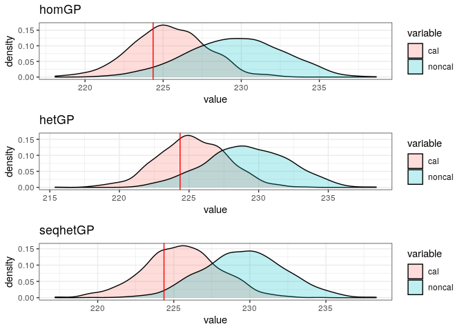
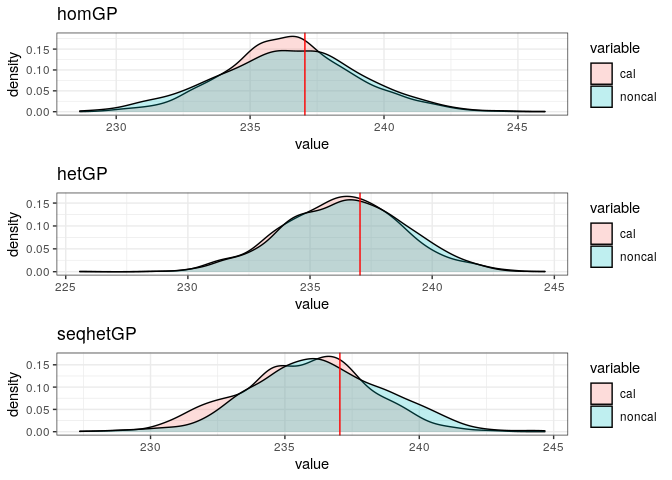

Calibration of the Ocean Simulator
================
Pierre Barbillon
January 17, 2020

``` r
rm(list=ls())
library(ggplot2)
library(colorRamps)
library(gridExtra)
library(DiceKriging)
library(DiceDesign)
library(hetGP)
library(MCMCpack)
library(lhs)
library(mvtnorm)
library(parallel)
library(reshape2)
```

Loading simulator and GPEs (homGP, hetGP and seqhetGP which is hetGP
with a sequential design)

``` r
# functions
source("SimulatorAndFunctions.R")
source("FunctionCalibration.R")
```

Fixing seed

``` r
seed=1234
set.seed(seed)
```

## Retrieving field data

``` r
Field = read.table("FieldData.csv",sep=" ")
Xfield = as.matrix(Field[,1:4])
Yfieldnoise = Field[,5]
n = nrow(Xfield)
Ym <- mean(Yfieldnoise)
Yv <- var(Yfieldnoise)
YfieldnoiseN <- (Yfieldnoise-Ym)/sqrt(Yv)
vareps = 2^2 
```

## Emulators

Either

``` r
#load("EmulatorCalib4D.Rdata")
```

Or

``` r
## From Static design
Static = read.table("staticDOEcalibration.csv")
Xsim = as.matrix(Static[,1:4])
Ysim = Static[,5]
YsimN = (Ysim-Ym)/sqrt(Yv)  
  
covtype <- "Matern5_2"
noiseControl <- list(g_min=1e-6, g_bounds=c(1e-6, 1), lowerDelta=log(1e-6))
settings <- list(linkThetas="none", initStrategy="smoothed", return.hom=TRUE)
lower <- c(0.01, 0.01, 0.001, 0.001) 
upper <- c(30, 30, 100, 100) 

het <- mleHetGP(Xsim, YsimN, lower=lower, upper=upper, covtype=covtype, noiseControl=noiseControl, 
                settings=settings, maxit=10000)
hom <- het$modHom

## Sequential design
Seq = read.table("seqDOEcalibration.csv")
Xseq = as.matrix(Seq[,1:4])
Yseq = Seq[,5]
YseqN = (Yseq-Ym)/sqrt(Yv)  
  
covtype <- "Matern5_2"
noiseControl <- list(g_min=1e-6, g_bounds=c(1e-6, 1), lowerDelta=log(1e-6))
settings <- list(linkThetas="none", initStrategy="smoothed", return.hom=TRUE)
lower <- c(0.01, 0.01, 0.001, 0.001) 
upper <- c(30, 30, 100, 100) 

seqhet <- mleHetGP(Xseq, YseqN, lower=lower, upper=upper, covtype=covtype, noiseControl=noiseControl, 
                settings=settings, maxit=10000)
```

## Calibration

Settings for MCMC

``` r
nMCMC = 1e5  #1e6
nburnin =  2e4 
# variance for random walks
Vrw0 <- diag(c(.05, .05, .1)) 
Vrw <- diag(c(.05,.05,.1,.1))
Uprior =c(.5,.5)
Thin = 100
```

Calibration with homGP

``` r
homMLEdisc = RangeEstim(Xfield[,1:2],YfieldnoiseN,hom,Uprior,vareps)
# Run MH algo for calibration is time consuming
# calHom <- MCMCmetrop1R(postcalibrationwithdisc, XF=Xfield[,1:2], yF=YfieldnoiseN, GP=hom,
#                        Sigdisc=homMLEdisc$Sigdisc,priorUpBounds2b=.5/Yv,logvar=T
#                              ,logfun=TRUE, theta.init=c(0.5,0.5,log(1/Yv),log(.1/Yv)),
#                              burnin=nburnin, mcmc=nMCMC,V=Vrw,thin=Thin)
# write.table(calHom,file="calHom.csv")


# reloading saved calibration results
calHom = read.table("calHom.csv",h=T,sep=" ")
calHom = as.matrix(calHom)
dfcalhom = as.data.frame(calHom)
names(dfcalhom) = c("u1","u2","s2f","s2b")
dfcalhom[,1:2] = dfcalhom[,1:2] * 900 +100
dfcalhom[,3] = exp(dfcalhom[,3]) * Yv
dfcalhom[,4] = exp(dfcalhom[,4]) * Yv
hom1 = ggplot(dfcalhom,aes(x=u1,stat(density)))+ xlab(expression(K[x])) + geom_density() + theme_bw() + xlim(50,1000) + geom_vline(aes(xintercept=700),color="red")
hom2 = ggplot(dfcalhom,aes(x=u2,stat(density))) + xlab(expression(K[y])) + geom_density() + theme_bw() +xlim(50,1000)  + geom_vline(aes(xintercept=200),color="red")
hom3 = ggplot(dfcalhom,aes(x=s2f,stat(density)))+ xlab(expression(sigma[epsilon]^2))  + geom_density() + theme_bw() + xlim(0,7) + geom_vline(aes(xintercept=4),color="red")
hom4 = ggplot(dfcalhom,aes(x=s2b,stat(density)))+ xlab(expression(sigma[MD]^2)) + geom_density() + theme_bw() + xlim(0,2) 
```

Calibration with hetGP

``` r
hetMLEdisc = RangeEstim(Xfield[,1:2],YfieldnoiseN,het,Uprior,vareps)
# Run MH algo for calibration is time consuming
# calHet <- MCMCmetrop1R(postcalibrationwithdisc, XF=Xfield[,1:2], yF=YfieldnoiseN, GP=het,
#                              Sigdisc=hetMLEdisc$Sigdisc,priorUpBounds2b=.5/Yv,logvar=T
#                              ,logfun=TRUE, theta.init=c(0.5,0.5,log(1/Yv),log(.1/Yv)),
#                              burnin=nburnin, mcmc=nMCMC,V=Vrw,thin=Thin)
# write.table(calHetSmDisc,file="calHet.csv")

# reloading saved calibration results
calHet = read.table("calHet.csv",h=T,sep=" ")
calHet = as.matrix(calHet)
dfcalhet = as.data.frame(calHet)
names(dfcalhet) = c("u1","u2","s2f","s2b")
dfcalhet[,1:2] = dfcalhet[,1:2] * 900 +100
dfcalhet[,3] = exp(dfcalhet[,3]) * Yv
dfcalhet[,4] = exp(dfcalhet[,4]) * Yv
het1 = ggplot(dfcalhet,aes(x=u1,stat(density))) + xlab(expression(K[x]))+ geom_density() + theme_bw() + xlim(50,1000) + geom_vline(aes(xintercept=700),color="red")
het2 = ggplot(dfcalhet,aes(x=u2,stat(density)))+ xlab(expression(K[y])) + geom_density() + theme_bw() +xlim(50,1000)  + geom_vline(aes(xintercept=200),color="red")
het3 = ggplot(dfcalhet,aes(x=s2f,stat(density)))+ xlab(expression(sigma[epsilon]^2)) + geom_density() + theme_bw() + xlim(0,7) + geom_vline(aes(xintercept=4),color="red")
het4 = ggplot(dfcalhet,aes(x=s2b,stat(density))) + xlab(expression(sigma[MD]^2)) + geom_density() + theme_bw() + xlim(0,2) 
```

Calibration with
seqhetGP

``` r
seqhetMLEdisc = RangeEstim(Xfield[,1:2],YfieldnoiseN,seqhet,Uprior,vareps)
# Run MH algo for calibration is time consuming
# calSeqHet <- MCMCmetrop1R(postcalibrationwithdisc, XF=Xfield[,1:2], yF=YfieldnoiseN, GP=seqhet,
#                                 Sigdisc=seqhetMLEdisc$Sigdisc,priorUpBounds2b=.5/Yv,logvar=T
#                              ,logfun=TRUE, theta.init=c(0.5,0.5,log(1/Yv),log(.1/Yv)),
#                              burnin=nburnin, mcmc=nMCMC,V=Vrw,thin=Thin)
#write.table(calSeqHet,file="calSeqHet.csv")

# reloading saved calibration results
calSeqHet = read.table("calSeqHet.csv",h=T,sep=" ")
calSeqHet = as.matrix(calSeqHet)
dfcalseqhet = as.data.frame(calSeqHet)
names(dfcalseqhet) = c("u1","u2","s2f","s2b")
dfcalseqhet[,1:2] = dfcalseqhet[,1:2] * 900 +100
dfcalseqhet[,3] = exp(dfcalseqhet[,3]) * Yv
dfcalseqhet[,4] = exp(dfcalseqhet[,4]) * Yv
seqhet1 = ggplot(dfcalseqhet,aes(x=u1,stat(density))) + xlab(expression(K[x]))+ geom_density() + theme_bw() + xlim(50,1000) + geom_vline(aes(xintercept=700),color="red")
seqhet2 = ggplot(dfcalseqhet,aes(x=u2,stat(density)))+ xlab(expression(K[y])) + geom_density() + theme_bw() +xlim(50,1000)  + geom_vline(aes(xintercept=200),color="red")
seqhet3 = ggplot(dfcalseqhet,aes(x=s2f,stat(density))) + xlab(expression(sigma[epsilon]^2))+ geom_density() + theme_bw() + xlim(0,7) + geom_vline(aes(xintercept=4),color="red")
seqhet4 = ggplot(dfcalseqhet,aes(x=s2b,stat(density)))+ xlab(expression(sigma[MD]^2))  + geom_density() + theme_bw() + xlim(0,2) 
```

``` r
grid.arrange(arrangeGrob(hom1,hom2,hom3,hom4,top="homGP",ncol=4),arrangeGrob(het1,het2,het3,het4,top="hetGP",ncol=4),
             arrangeGrob(seqhet1,seqhet2,seqhet3,seqhet4,top="seq hetGP",ncol=4),nrow=3,ncol=1)
```

    ## Warning: Removed 55 rows containing non-finite values (stat_density).

<!-- -->

## Prediction

Loading test data

``` r
test = read.csv("testdata2D.csv",sep=" ")
testdesign = as.matrix(test[,1:2])
Ztest.mean = test[,3]
```

We run prediction from a uniform prior on the calibration parameter and
prediction from the posterior distribution of the calibration parameter
and the discrepancy.

Note that the seed is not fixed anymore since we use the parallel
computations.

``` r
npred = nMCMC/Thin
ZpredhomGPnoncal = mclapply(1:npred,prednoncal,GP=hom,vareps=vareps,loc=testdesign,Ym=Ym,Yv=Yv,mc.cores = 8)
ZpredhomGPcal = mclapply(1:npred,predcal,GP=hom,cal=calHom,vareps=vareps,
                         loc=testdesign,YfN=YfieldnoiseN,Xfield=Xfield,Ym=Ym,Yv=Yv,psi=homMLEdisc$psi
                         ,mc.cores = 8)
ZpredhomGPnoncal = Reduce(rbind,ZpredhomGPnoncal)
ZpredhomGPcal = Reduce(rbind,ZpredhomGPcal)
```

``` r
ZpredhetGPnoncal = mclapply(1:npred,prednoncal,GP=het,vareps=vareps,loc=testdesign,Ym=Ym,Yv=Yv,mc.cores = 8)
ZpredhetGPcal = mclapply(1:npred,predcal,GP=het,cal=calHet,
                         vareps=vareps,loc=testdesign,YfN=YfieldnoiseN,Xfield=Xfield,Ym=Ym,Yv=Yv,psi=hetMLEdisc$psi
                         ,mc.cores = 8)
ZpredhetGPnoncal = Reduce(rbind,ZpredhetGPnoncal)
ZpredhetGPcal = Reduce(rbind,ZpredhetGPcal)
```

``` r
ZpredseqhetGPnoncal = mclapply(1:npred,prednoncal,GP=seqhet,vareps=vareps,loc=testdesign,Ym=Ym,Yv=Yv,mc.cores = 8)
ZpredseqhetGPcal = mclapply(1:npred,predcal,GP=seqhet,cal=calSeqHet,
                            vareps=vareps,loc=testdesign,YfN=YfieldnoiseN,Xfield=Xfield,Ym=Ym,Yv=Yv,psi=seqhetMLEdisc$psi,
                            mc.cores = 8)
ZpredseqhetGPnoncal = Reduce(rbind,ZpredseqhetGPnoncal)
ZpredseqhetGPcal = Reduce(rbind,ZpredseqhetGPcal)
```

### Some plots

``` r
nlocplot=10
for (k in 1:nlocplot){
    dfpredhom = data.frame(cal=ZpredhomGPcal[,k],noncal = ZpredhomGPnoncal[,k] )
  df2predhom = melt(dfpredhom)
  ghom = ggplot(df2predhom,aes(x=value, fill=variable)) + geom_density(alpha=0.25)+ theme_bw()  + geom_vline(aes(xintercept=Ztest.mean[k]),color="red")+ggtitle("homGP")
  dfpredhet = data.frame(cal=ZpredhetGPcal[,k],noncal = ZpredhetGPnoncal[,k] )
  df2predhet = melt(dfpredhet)
  ghet = ggplot(df2predhet,aes(x=value, fill=variable)) + geom_density(alpha=0.25)+ theme_bw()  + geom_vline(aes(xintercept=Ztest.mean[k]),color="red")+ggtitle("hetGP")
  dfpredseqhet = data.frame(cal=ZpredseqhetGPcal[,k],noncal = ZpredseqhetGPnoncal[,k] )
  df2predsehet = melt(dfpredseqhet)
  ghetseq = ggplot(df2predsehet,aes(x=value, fill=variable)) + geom_density(alpha=0.25)+ theme_bw()  + geom_vline(aes(xintercept=Ztest.mean[k]),color="red")+ggtitle("seqhetGP")
  print(grid.arrange(ghom,ghet,ghetseq))
}
```

    ## No id variables; using all as measure variables
    ## No id variables; using all as measure variables
    ## No id variables; using all as measure variables

    ## TableGrob (3 x 1) "arrange": 3 grobs
    ##   z     cells    name           grob
    ## 1 1 (1-1,1-1) arrange gtable[layout]
    ## 2 2 (2-2,1-1) arrange gtable[layout]
    ## 3 3 (3-3,1-1) arrange gtable[layout]

    ## No id variables; using all as measure variables
    ## No id variables; using all as measure variables
    ## No id variables; using all as measure variables

<!-- -->

    ## TableGrob (3 x 1) "arrange": 3 grobs
    ##   z     cells    name           grob
    ## 1 1 (1-1,1-1) arrange gtable[layout]
    ## 2 2 (2-2,1-1) arrange gtable[layout]
    ## 3 3 (3-3,1-1) arrange gtable[layout]

    ## No id variables; using all as measure variables
    ## No id variables; using all as measure variables
    ## No id variables; using all as measure variables

<!-- -->

    ## TableGrob (3 x 1) "arrange": 3 grobs
    ##   z     cells    name           grob
    ## 1 1 (1-1,1-1) arrange gtable[layout]
    ## 2 2 (2-2,1-1) arrange gtable[layout]
    ## 3 3 (3-3,1-1) arrange gtable[layout]

    ## No id variables; using all as measure variables
    ## No id variables; using all as measure variables
    ## No id variables; using all as measure variables

<!-- -->

    ## TableGrob (3 x 1) "arrange": 3 grobs
    ##   z     cells    name           grob
    ## 1 1 (1-1,1-1) arrange gtable[layout]
    ## 2 2 (2-2,1-1) arrange gtable[layout]
    ## 3 3 (3-3,1-1) arrange gtable[layout]

    ## No id variables; using all as measure variables
    ## No id variables; using all as measure variables
    ## No id variables; using all as measure variables

<!-- -->

    ## TableGrob (3 x 1) "arrange": 3 grobs
    ##   z     cells    name           grob
    ## 1 1 (1-1,1-1) arrange gtable[layout]
    ## 2 2 (2-2,1-1) arrange gtable[layout]
    ## 3 3 (3-3,1-1) arrange gtable[layout]

    ## No id variables; using all as measure variables
    ## No id variables; using all as measure variables
    ## No id variables; using all as measure variables

<!-- -->

    ## TableGrob (3 x 1) "arrange": 3 grobs
    ##   z     cells    name           grob
    ## 1 1 (1-1,1-1) arrange gtable[layout]
    ## 2 2 (2-2,1-1) arrange gtable[layout]
    ## 3 3 (3-3,1-1) arrange gtable[layout]

    ## No id variables; using all as measure variables
    ## No id variables; using all as measure variables
    ## No id variables; using all as measure variables

<!-- -->

    ## TableGrob (3 x 1) "arrange": 3 grobs
    ##   z     cells    name           grob
    ## 1 1 (1-1,1-1) arrange gtable[layout]
    ## 2 2 (2-2,1-1) arrange gtable[layout]
    ## 3 3 (3-3,1-1) arrange gtable[layout]

    ## No id variables; using all as measure variables
    ## No id variables; using all as measure variables
    ## No id variables; using all as measure variables

<!-- -->

    ## TableGrob (3 x 1) "arrange": 3 grobs
    ##   z     cells    name           grob
    ## 1 1 (1-1,1-1) arrange gtable[layout]
    ## 2 2 (2-2,1-1) arrange gtable[layout]
    ## 3 3 (3-3,1-1) arrange gtable[layout]

    ## No id variables; using all as measure variables
    ## No id variables; using all as measure variables
    ## No id variables; using all as measure variables

<!-- -->

    ## TableGrob (3 x 1) "arrange": 3 grobs
    ##   z     cells    name           grob
    ## 1 1 (1-1,1-1) arrange gtable[layout]
    ## 2 2 (2-2,1-1) arrange gtable[layout]
    ## 3 3 (3-3,1-1) arrange gtable[layout]

    ## No id variables; using all as measure variables
    ## No id variables; using all as measure variables
    ## No id variables; using all as measure variables

<!-- --><!-- -->

    ## TableGrob (3 x 1) "arrange": 3 grobs
    ##   z     cells    name           grob
    ## 1 1 (1-1,1-1) arrange gtable[layout]
    ## 2 2 (2-2,1-1) arrange gtable[layout]
    ## 3 3 (3-3,1-1) arrange gtable[layout]

### MSEs and scores

``` r
MSEhomnoncal = mean((rowMeans(ZpredhomGPnoncal)-Ztest.mean)^2)
MSEhomcal = mean((rowMeans(ZpredhomGPcal)-Ztest.mean)^2)
MSEhetnoncal = mean((rowMeans(ZpredhetGPnoncal)-Ztest.mean)^2)
MSEhetcal = mean((rowMeans(ZpredhetGPcal)-Ztest.mean)^2)
MSEseqhetnoncal = mean((rowMeans(ZpredseqhetGPnoncal)-Ztest.mean)^2)
MSEseqhetcal = mean((rowMeans(ZpredseqhetGPcal)-Ztest.mean)^2)
```

``` r
Scorehomnoncal = scoreEstDens(ZpredhomGPnoncal,Ztest.mean)
Scorehomcal = scoreEstDens(ZpredhomGPcal,Ztest.mean)
Scorehetnoncal = scoreEstDens(ZpredhetGPnoncal,Ztest.mean)
Scorehetcal = scoreEstDens(ZpredhetGPcal,Ztest.mean)
Scoreseqhetnoncal = scoreEstDens(ZpredseqhetGPnoncal,Ztest.mean)
Scoreseqhetcal = scoreEstDens(ZpredseqhetGPcal,Ztest.mean)
```

## Other pre-calibration

We try other three other calibrations from L2 minimization, and two
guesses (a good and a bad one) for the calibration parameter.

SS minimizer for
homGP

``` r
L2minhom = optim(c(.5,.5),SumOfSquares,lower=0,upper=1,GP=hom,XF=Xfield[,1:2],yF=YfieldnoiseN)
```

    ## Warning in optim(c(0.5, 0.5), SumOfSquares, lower = 0, upper = 1, GP = hom, :
    ## bounds can only be used with method L-BFGS-B (or Brent)

``` r
L2minhom$par* 900 +100
```

    ## [1] 1000.0000  298.3708

``` r
L2minhom$value
```

    ## [1] 33.78904

``` r
SumOfSquares((c(700,200)-100)/900,hom,Xfield[,1:2],YfieldnoiseN)
```

    ## [1] 34.49721

SS minimizer for
hetGP

``` r
L2minhet = optim(c(.5,.5),SumOfSquares,lower=0,upper=1,GP=het,XF=Xfield[,1:2],yF=YfieldnoiseN)
```

    ## Warning in optim(c(0.5, 0.5), SumOfSquares, lower = 0, upper = 1, GP = het, :
    ## bounds can only be used with method L-BFGS-B (or Brent)

``` r
L2minhet$par* 900 +100
```

    ## [1] 1000.0000  309.4502

``` r
L2minhet$value
```

    ## [1] 34.13061

``` r
SumOfSquares((c(700,200)-100)/900,het,Xfield[,1:2],YfieldnoiseN)
```

    ## [1] 34.69017

SS minimizer for
seqhetGP

``` r
L2minseqhet = optim(c(.5,.5),SumOfSquares,lower=0,upper=1,GP=seqhet,XF=Xfield[,1:2],yF=YfieldnoiseN)
```

    ## Warning in optim(c(0.5, 0.5), SumOfSquares, lower = 0, upper = 1, GP = seqhet, :
    ## bounds can only be used with method L-BFGS-B (or Brent)

``` r
L2minseqhet$par* 900 +100
```

    ## [1] 992.0018 316.7748

``` r
L2minseqhet$value
```

    ## [1] 35.93268

``` r
SumOfSquares((c(700,200)-100)/900,seqhet,Xfield[,1:2],YfieldnoiseN)
```

    ## [1] 36.75453

We propose a “good guess” and a “bad guess”.

``` r
goodguess = (c(750, 215) -100)/900 
badguess = (c(400,500) -100)/900
```

Prediction for
homGP

``` r
ZpredhomGPnoncalL2 = mclapply(1:npred,prednoncalfixed,GP=hom,u=L2minhom$par,vareps=vareps,Ym=Ym,Yv=Yv,loc=testdesign,mc.cores = 8)
ZpredhomGPnoncalL2 = Reduce(rbind,ZpredhomGPnoncalL2)
ZpredhomGPnoncalgoodguess = mclapply(1:npred,prednoncalfixed,GP=hom,u=goodguess,vareps=vareps,Ym=Ym,Yv=Yv,loc=testdesign,mc.cores = 8)
ZpredhomGPnoncalgoodguess = Reduce(rbind,ZpredhomGPnoncalgoodguess)
ZpredhomGPnoncalbadguess = mclapply(1:npred,prednoncalfixed,GP=hom,u=badguess,vareps=vareps,Ym=Ym,Yv=Yv,loc=testdesign,mc.cores = 8)
ZpredhomGPnoncalbadguess = Reduce(rbind,ZpredhomGPnoncalbadguess)
```

Prediction for
hetGP

``` r
ZpredhetGPnoncalL2 = mclapply(1:npred,prednoncalfixed,GP=het,u=L2minhet$par,vareps=vareps,Ym=Ym,Yv=Yv,loc=testdesign,mc.cores = 8)
ZpredhetGPnoncalL2 = Reduce(rbind,ZpredhetGPnoncalL2)
ZpredhetGPnoncalgoodguess = mclapply(1:npred,prednoncalfixed,GP=het,u=goodguess,vareps=vareps,Ym=Ym,Yv=Yv,loc=testdesign,mc.cores = 8)
ZpredhetGPnoncalgoodguess = Reduce(rbind,ZpredhetGPnoncalgoodguess)
ZpredhetGPnoncalbadguess = mclapply(1:npred,prednoncalfixed,GP=het,u=badguess,vareps=vareps,Ym=Ym,Yv=Yv,loc=testdesign,mc.cores = 8)
ZpredhetGPnoncalbadguess = Reduce(rbind,ZpredhetGPnoncalbadguess)
```

Prediction for
seqhetGP

``` r
ZpredseqhetGPnoncalL2 = mclapply(1:npred,prednoncalfixed,GP=seqhet,u=L2minseqhet$par,vareps=vareps,Ym=Ym,Yv=Yv,loc=testdesign,mc.cores = 8)
ZpredseqhetGPnoncalL2 = Reduce(rbind,ZpredseqhetGPnoncalL2)
ZpredseqhetGPnoncalgoodguess = mclapply(1:npred,prednoncalfixed,GP=seqhet,u=goodguess,vareps=vareps,Ym=Ym,Yv=Yv,loc=testdesign,mc.cores = 8)
ZpredseqhetGPnoncalgoodguess = Reduce(rbind,ZpredseqhetGPnoncalgoodguess)
ZpredseqhetGPnoncalbadguess = mclapply(1:npred,prednoncalfixed,GP=seqhet,u=badguess,vareps=vareps,Ym=Ym,Yv=Yv,loc=testdesign,mc.cores = 8)
ZpredseqhetGPnoncalbadguess = Reduce(rbind,ZpredseqhetGPnoncalbadguess)
```

``` r
MSEhomnoncalL2 = mean((rowMeans(ZpredhomGPnoncalL2)-Ztest.mean)^2)
MSEhomnoncalgoodguess = mean((rowMeans(ZpredhomGPnoncalgoodguess)-Ztest.mean)^2)
MSEhomnoncalbadguess = mean((rowMeans(ZpredhomGPnoncalbadguess)-Ztest.mean)^2)
MSEhetnoncalL2 = mean((rowMeans(ZpredhetGPnoncalL2)-Ztest.mean)^2)
MSEhetnoncalgoodguess = mean((rowMeans(ZpredhetGPnoncalgoodguess)-Ztest.mean)^2)
MSEhetnoncalbadguess = mean((rowMeans(ZpredhetGPnoncalbadguess)-Ztest.mean)^2)
MSEseqhetnoncalL2 = mean((rowMeans(ZpredseqhetGPnoncalL2)-Ztest.mean)^2)
MSEseqhetnoncalgoodguess = mean((rowMeans(ZpredseqhetGPnoncalgoodguess)-Ztest.mean)^2)
MSEseqhetnoncalbadguess = mean((rowMeans(ZpredseqhetGPnoncalbadguess)-Ztest.mean)^2)
```

1st row for homGP, 2nd row for hetGP, 3rd row for seqhetGP 1st column
for L2 estimate, 2nd column for bad guess, 3rd column for good guess,
4th for unif prior, 5th post
calibration

``` r
rbind(c(MSEhomnoncalL2,MSEhomnoncalbadguess,MSEhomnoncalgoodguess,MSEhomnoncal,MSEhomcal),
      c(MSEhetnoncalL2,MSEhetnoncalbadguess,MSEhetnoncalgoodguess,MSEhetnoncal,MSEhetcal),
      c(MSEseqhetnoncalL2,MSEseqhetnoncalbadguess,MSEseqhetnoncalgoodguess,MSEseqhetnoncal,MSEseqhetcal))
```

    ##          [,1]     [,2]     [,3]     [,4]     [,5]
    ## [1,] 83.77190 85.44316 83.80112 85.41880 84.15743
    ## [2,] 83.81073 85.53442 84.04735 84.57933 84.42222
    ## [3,] 83.85439 85.74585 83.92970 85.10718 84.07739

``` r
ScorehomnoncalL2 = scoreEstDens(ZpredhomGPnoncalL2,Ztest.mean)
Scorehomnoncalbadguess = scoreEstDens(ZpredhomGPnoncalbadguess,Ztest.mean)
Scorehomnoncalgoodguess = scoreEstDens(ZpredhomGPnoncalgoodguess,Ztest.mean)
ScorehetnoncalL2 = scoreEstDens(ZpredhetGPnoncalL2,Ztest.mean)
Scorehetnoncalbadguess = scoreEstDens(ZpredhetGPnoncalbadguess,Ztest.mean)
Scorehetnoncalgoodguess = scoreEstDens(ZpredhetGPnoncalgoodguess,Ztest.mean)
ScoreseqhetnoncalL2 = scoreEstDens(ZpredseqhetGPnoncalL2,Ztest.mean)
Scoreseqhetnoncalbadguess = scoreEstDens(ZpredseqhetGPnoncalbadguess,Ztest.mean)
Scoreseqhetnoncalgoodguess = scoreEstDens(ZpredseqhetGPnoncalgoodguess,Ztest.mean)
```

1st row for homGP, 2nd row for hetGP, 3rd row for seqhetGP 1st column
for L2 estimate, 2nd column for bad guess, 3rd column for good guess,
4th for unif prior, 5th post
calibration

``` r
rbind(c(ScorehomnoncalL2,Scorehomnoncalbadguess,Scorehomnoncalgoodguess,Scorehomnoncal,Scorehomcal),
      c(ScorehetnoncalL2,Scorehetnoncalbadguess,Scorehetnoncalgoodguess,Scorehetnoncal,Scorehetcal),
      c(ScoreseqhetnoncalL2,Scoreseqhetnoncalbadguess,Scoreseqhetnoncalgoodguess,Scoreseqhetnoncal,Scoreseqhetcal))
```

    ##           [,1]      [,2]      [,3]      [,4]      [,5]
    ## [1,] -2.543532 -2.636955 -2.540506 -2.648940 -2.519055
    ## [2,] -2.495331 -2.544673 -2.482420 -2.577830 -2.431945
    ## [3,] -2.471494 -2.510947 -2.446159 -2.528338 -2.357650

``` r
VarPredhomnoncal = mean(apply(ZpredhomGPnoncal,1,var))
VarPredhomcal = mean(apply(ZpredhomGPcal,1,var))
VarPredhetnoncal = mean(apply(ZpredhetGPnoncal,1,var))
VarPredhetcal = mean(apply(ZpredhetGPcal,1,var))
VarPredseqhetnoncal = mean(apply(ZpredseqhetGPnoncal,1,var))
VarPredseqhetcal = mean(apply(ZpredseqhetGPcal,1,var))
VarPredhomnoncalL2 = mean(apply(ZpredhomGPnoncalL2,1,var))
VarPredhomnoncalgoodguess = mean(apply(ZpredhomGPnoncalgoodguess,1,var))
VarPredhomnoncalbadguess = mean(apply(ZpredhomGPnoncalbadguess,1,var))
VarPredhetnoncalL2 = mean(apply(ZpredhetGPnoncalL2,1,var))
VarPredhetnoncalgoodguess = mean(apply(ZpredhetGPnoncalgoodguess,1,var))
VarPredhetnoncalbadguess = mean(apply(ZpredhetGPnoncalbadguess,1,var))
VarPredseqhetnoncalL2 = mean(apply(ZpredseqhetGPnoncalL2,1,var))
VarPredseqhetnoncalgoodguess = mean(apply(ZpredseqhetGPnoncalgoodguess,1,var))
VarPredseqhetnoncalbadguess = mean(apply(ZpredseqhetGPnoncalbadguess,1,var))
```

1st row for homGP, 2nd row for hetGP, 3rd row for seqhetGP 1st column
for L2 estimate, 2nd column for bad guess, 3rd column for good guess,
4th for unif prior, 5th post
calibration

``` r
rbind(c(VarPredhomnoncalL2,VarPredhomnoncalbadguess,VarPredhomnoncalgoodguess,VarPredhomnoncal,VarPredhomcal),
      c(VarPredhetnoncalL2,VarPredhetnoncalbadguess,VarPredhetnoncalgoodguess,VarPredhetnoncal,VarPredhetcal),
      c(VarPredseqhetnoncalL2,VarPredseqhetnoncalbadguess,VarPredseqhetnoncalgoodguess,VarPredseqhetnoncal,VarPredseqhetcal))
```

    ##          [,1]     [,2]      [,3]     [,4]      [,5]
    ## [1,] 98.45757 94.53598  99.98640 94.35108  98.11215
    ## [2,] 97.05579 94.83946  99.64745 95.86531 100.15702
    ## [3,] 99.41299 96.83831 104.31305 99.04596  96.55007
