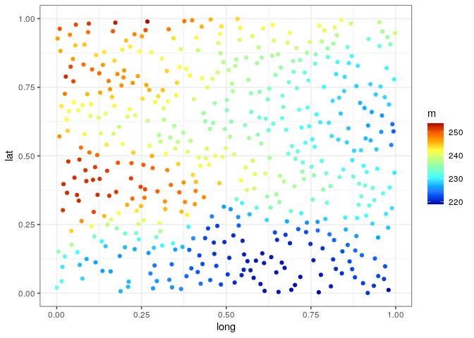
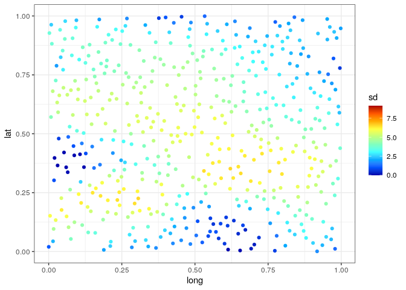
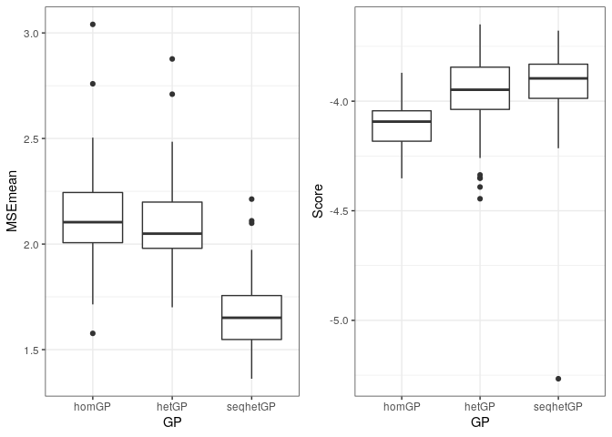

Ocean Example
================
Pierre Barbillon
June 16, 2020

``` r
library(ggplot2)
library(colorRamps)
library(gridExtra)
library(DiceKriging)
library(DiceDesign)
library(hetGP)
library(MCMCpack)
library(lhs)
library(mvtnorm)
library(reshape2)
library(plyr)
```

We load the simulator and some useful functions.

``` r
source("SimulatorAndFunctions.R")
```

    ## Loading required package: parallel

The seed is set for replication:

``` r
seed=1234
set.seed(seed)
```

## Emulation

### Static design

We start with a space filling design and we make \(20\) replicates at
each unique location.

``` r
n = 50
X0 = randomLHS(n,2)
X0 = maximinSA_LHS(X0)$design
X <- rbind(X0, X0, X0, X0, X0, X0, X0, X0, X0, X0)
X <- rbind(X, X)
Z <- apply(X, 1, simulator)
```

The input domain is normalized in \([0,1]^2\). We center and reduce the
outputs.

``` r
Zm <- mean(Z)
Zv <- var(Z)
Z <- (Z - Zm)/sqrt(Zv)
```

These are the settings for computing homoskedastic and heteroskedastic
GPs.

``` r
# settings for GPs
lower <- rep(0.01, 2)
upper <- rep(10, 2)
covtype <- "Matern5_2"
nc <- list(g_min=1e-6, g_bounds=c(1e-6, 1),  
           lowerDelta=log(1e-6))
settings <- list(linkThetas="none", logN=TRUE, initStrategy="smoothed", 
                 checkHom=TRUE, penalty=TRUE, trace=0, return.matrices=TRUE, return.hom=FALSE)
control <- list(tol_dist=1e-4, tol_diff=1e-4, multi.start=30)
```

Then, they are fitted on the data:

``` r
## Homoskedastic
Ghom <- mleHomGP(X, Z, lower=lower, upper=upper, covtype=covtype,
                known=list(beta0=0), maxit=1000) 

## Heteroskedastic 
Ghet <- mleHetGP(X, Z, lower=lower, upper=upper, covtype=covtype, 
                noiseControl=nc, settings=settings, known=list(beta0=0), maxit=1000)
```

### Sequential design

We use the static design as the initial design but we only use \(5\)
replicates instead of \(20\). The remaining points are added
sequentially.

``` r
ninitseq = 5
n=nrow(X0)
Xseq <- X[1:(ninitseq*n),]
Y <- Z[1:(ninitseq*n)]
mod <- mleHetGP(Xseq, Y, lower=lower, upper=upper, covtype=covtype, 
                noiseControl=nc, settings=settings, known=list(beta0=0), maxit=1000)

nadd = nrow(X)-nrow(Xseq)  

h <- rep(NA, nadd)
## acquisitions
for(i in 1:nadd) { 
  
  ## choose lookahead horizon and solve IMSPE
  h[i] <- horizon(mod)
  opt <- IMSPE_optim(mod, h[i], control=control)
  cat("i=", i, ", h=", h[i], "\n", sep="")
  
  ## evaluate the simulator
  ynew <- (simulator(opt$par) -Zm)/sqrt(Zv)
  
  ## update the fit
  mod <- update(mod, Xnew=opt$par, Znew=ynew, ginit=mod$g*1.01)
  if(i %% 25 == 0){
    mod2 <- mleHetGP(list(X0=mod$X0, Z0=mod$Z0, mult=mod$mult),
                     Z=mod$Z, lower=lower, upper=upper, covtype=covtype, 
                     noiseControl=nc, settings=settings, known=list(beta0=0), 
                     maxit=1000)
    if(mod2$ll > mod$ll) mod <- mod2  
  }
}
seqGhet=mod
```

### Results

Predictions on a grid

``` r
de = as.matrix(expand.grid(seq(0,1,.01),seq(0,1,.01)))
predHomde = predict(x = de, object = Ghom)
gridHom = as.data.frame(cbind(de[,1:2],predHomde$mean,predHomde$sd2,predHomde$nugs,sqrt(predHomde$sd2 + predHomde$nugs)))
names(gridHom) = c("long","lat","mean","varmean","nug","psd")
predhetde = predict(x = de, object = Ghet)
gridhet = as.data.frame(cbind(de[,1:2],predhetde$mean,predhetde$sd2,predhetde$nugs,sqrt(predhetde$sd2 + predhetde$nugs)))
names(gridhet) = c("long","lat","mean","varmean","nug","psd")
designseq = as.data.frame(cbind(mod$X0,mod$mult))
names(designseq) = c("long","lat","rep")
predhetseqde = predict(x = de, object = mod)
gridhetseq = as.data.frame(cbind(de[,1:2],predhetseqde$mean,predhetseqde$sd2,predhetseqde$nugs, sqrt(predhetseqde$sd2 + predhetseqde$nugs)))
names(gridhetseq) = c("long","lat","mean","varmean","nug","psd")

# unnormalize the outputs
gridHom$mean = gridHom$mean * sqrt(Zv) + Zm
gridHom$varmean = gridHom$varmean * Zv
gridHom$psd = gridHom$psd * sqrt(Zv)
gridHom$nug = gridHom$nug * Zv
gridhet$mean = gridhet$mean * sqrt(Zv) + Zm
gridhet$varmean = gridhet$varmean * Zv
gridhet$psd = gridhet$psd * sqrt(Zv)
gridhet$nug = gridhet$nug * Zv
gridhetseq$mean = gridhetseq$mean * sqrt(Zv) + Zm
gridhetseq$varmean = gridhetseq$varmean * Zv
gridhetseq$psd = gridhetseq$psd * sqrt(Zv)
gridhetseq$nug = gridhetseq$nug * Zv
```

Plots for
homGP

``` r
ggplot(gridHom, aes(long, lat)) + geom_raster(aes(fill = mean), interpolate = TRUE) + scale_fill_gradientn(colours=matlab.like(10),limits=c(min(gridHom$mean,gridhet$mean),max(gridHom$mean,gridhet$mean)))
```

<!-- -->

``` r
ggplot(gridHom, aes(long, lat)) + geom_raster(aes(fill = psd), interpolate = TRUE)+ scale_fill_gradientn(colours=matlab.like(10),limits=c(0,max(gridHom$psd,gridhet$psd,6.5)))
```

<!-- -->

Plots for
hetGP

``` r
ggplot(gridhet, aes(long, lat)) + geom_raster(aes(fill = mean), interpolate = TRUE) +scale_fill_gradientn(colours=matlab.like(10),limits=c(min(gridHom$mean,gridhet$mean),max(gridHom$mean,gridhet$mean)))
```

<!-- -->

``` r
ggplot(gridhet, aes(long, lat)) + geom_raster(aes(fill = psd), interpolate = TRUE)+ scale_fill_gradientn(colours=matlab.like(10),limits=c(0,max(gridHom$psd,gridhet$psd,6.5)))
```

<!-- -->

Plots for
SeqhetGP

``` r
ggplot(gridhetseq, aes(long, lat)) + geom_raster(aes(fill = mean), interpolate = TRUE) + scale_fill_gradientn(colours=matlab.like(10))
```

<!-- -->

``` r
ggplot(gridhetseq, aes(long, lat)) + geom_raster(aes(fill = mean), interpolate = TRUE) + scale_fill_gradientn(colours=matlab.like(10))+geom_point(data=designseq,aes(x=long,y=lat,colour=rep))+scale_color_gradient(low="grey", high="black")
```

<!-- -->

``` r
ggplot(gridhetseq, aes(long, lat)) + geom_raster(aes(fill = psd), interpolate = TRUE)+ scale_fill_gradientn(colours=matlab.like(10),limits=c(0,max(gridHom$psd,gridhet$psd,6.5)))+geom_point(data=designseq,aes(x=long,y=lat,colour=rep))+scale_color_gradient(low="grey", high="black")
```

<!-- -->

``` r
ggplot(gridhetseq, aes(long, lat)) + geom_raster(aes(fill = psd), interpolate = TRUE)+ scale_fill_gradientn(colours=matlab.like(10),limits=c(0,max(gridHom$psd,gridhet$psd,6.5)))+geom_text(data=designseq,aes(x=long,y=lat,label=rep))
```

<!-- -->

### Accuracy of prediction on the test data

We load the test data set and compute mean square errors and log scores
of the predictions.

``` r
test = read.csv("testdata2D.csv",sep=" ")
testdesign = as.matrix(test[,1:2])
Ztest.mean = test[,3]
Ztest.sd = test[,4]

#Hom GP
predhom = predict(x = testdesign, object = Ghom)
#Het GP
predhet = predict(x = testdesign, object = Ghet)
#Het GP seq
predHetseq = predict(x = testdesign, object = seqGhet)

# Normalize Ztest.mean
Ztest.mean.N = (Ztest.mean - Zm)/sqrt(Zv)
Ztest.sd.N = Ztest.sd/sqrt(Zv)

# MSE for the mean
msehom = mean(((predhom$mean-Ztest.mean.N))^2)
msehet = mean(((predhet$mean-Ztest.mean.N))^2)
msehetseq = mean(((predHetseq$mean-Ztest.mean.N))^2)

#MSE for sd
msehomsd = mean(((sqrt(predhom$nugs)-Ztest.sd.N))^2)
msehetsd = mean(((sqrt(predhet$nugs)-Ztest.sd.N))^2)
msehetseqsd = mean(((sqrt(predHetseq$nugs)-Ztest.sd.N))^2)

# scores for the prediction of a single run of the simulator
Ztest = (apply(testdesign,1,simulator)-Zm)/sqrt(Zv) # for computing scores on a single realization of the simulator
schom = mean(-(Ztest-predhom$mean)^2/(predhom$sd2+predhom$nugs) -log(predhom$sd2+predhom$nugs))
schet = mean(-(Ztest-predhet$mean)^2/(predhet$sd2+predhet$nugs) -log(predhet$sd2+predhet$nugs))
schetseq = mean(-(Ztest-predHetseq$mean)^2/(predHetseq$sd2+predHetseq$nugs) -log(predHetseq$sd2+predHetseq$nugs))
```

We compute the mean square error and the score for a prediction of a run
of the simulator.

``` r
c(msehom=msehom,msehet=msehet,msehetseq=msehetseq)
```

    ##     msehom     msehet  msehetseq 
    ## 0.03965506 0.03695992 0.02293363

``` r
c(msehom=msehomsd,msehet=msehetsd,msehetseq=msehetseqsd)
```

    ##     msehom     msehet  msehetseq 
    ## 0.02629828 0.01164999 0.02054881

``` r
c(scorehom=schom,scorehet=schet,scorehetseq=schetseq)
```

    ##    scorehom    scorehet scorehetseq 
    ##   0.6703442   0.7890090   0.8355525

To check the accuracy of the emulators, we plot the mean and the sd of
the Ocean simulator obtained from the test
design:

``` r
ggplot(test,aes(x=long,y=lat,col=m))+geom_point()+scale_color_gradientn(colours=matlab.like(10),limits=c(min(gridHom$mean,gridhet$mean),max(gridHom$mean,gridhet$mean)))+theme_bw()
```

<!-- -->

``` r
ggplot(test,aes(x=long,y=lat,col=sd))+geom_point()+scale_color_gradientn(colours=matlab.like(10),limits=c(0,max(gridHom$psd,gridhet$psd,6.5)))+theme_bw()
```

<!-- -->

## Replications

We replicated the emulation from the design building step (see R script
*OceanRepeatEmulation.R*). We load the result and display boxplots of
MSE and scores over the 100 replications.

``` r
RES = read.table("EmulationRep.csv",sep=" ")

# MSE for the mean
MSE = melt(RES[,1:3])
```

    ## No id variables; using all as measure variables

``` r
names(MSE) = c("GP","MSEmean")
MSE$GP =revalue(MSE$GP, c("msehom"="homGP", "msehet"="hetGP","msehetseq"="seqhetGP"))
p1=ggplot(MSE,aes(x=GP,y=MSEmean))+theme_bw()+geom_boxplot()


# MSE sd
MSEsd = melt(RES[,4:6])
```

    ## No id variables; using all as measure variables

``` r
names(MSEsd) = c("GP","MSEsd")
MSEsd$GP =revalue(MSEsd$GP, c("msehomsd"="homGP", "msehetsd"="hetGP","msehetseqsd"="seqhetGP"))
p2=ggplot(MSEsd,aes(x=GP,y=MSEsd))+theme_bw()+geom_boxplot()


# Prediction Score 
Score = melt(RES[,7:9])
```

    ## No id variables; using all as measure variables

``` r
names(Score) = c("GP","Score")
Score$GP =revalue(Score$GP, c("scorehom"="homGP", "scorehet"="hetGP","scorehetseq"="seqhetGP"))
p3=ggplot(Score,aes(x=GP,y=Score))+theme_bw()+geom_boxplot()

grid.arrange(p1,p2,p3,nrow=1)
```

<!-- -->

Find out which is best for MSE, and Scores

``` r
MSE = RES[,1:3]
names(MSE) = c("homGP","hetGP","seqhetGP")
table(apply(MSE,1,which.min))
```

    ## 
    ##  1  2  3 
    ##  4  2 94

``` r
Score = (RES[,7:9])
table(apply(Score,1,which.max))
```

    ## 
    ##  2  3 
    ## 44 56
